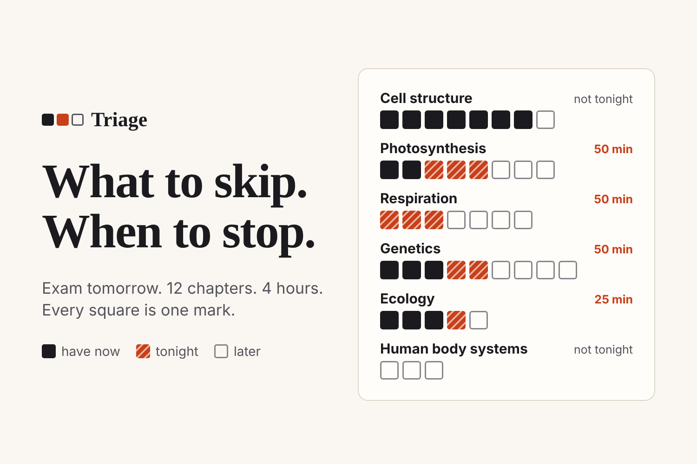
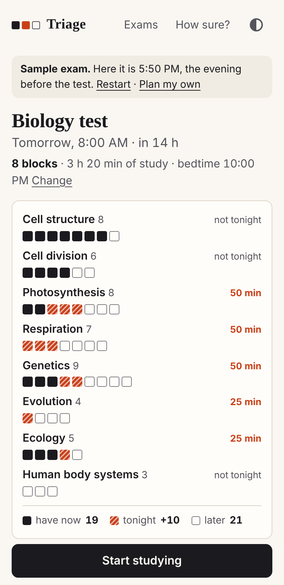
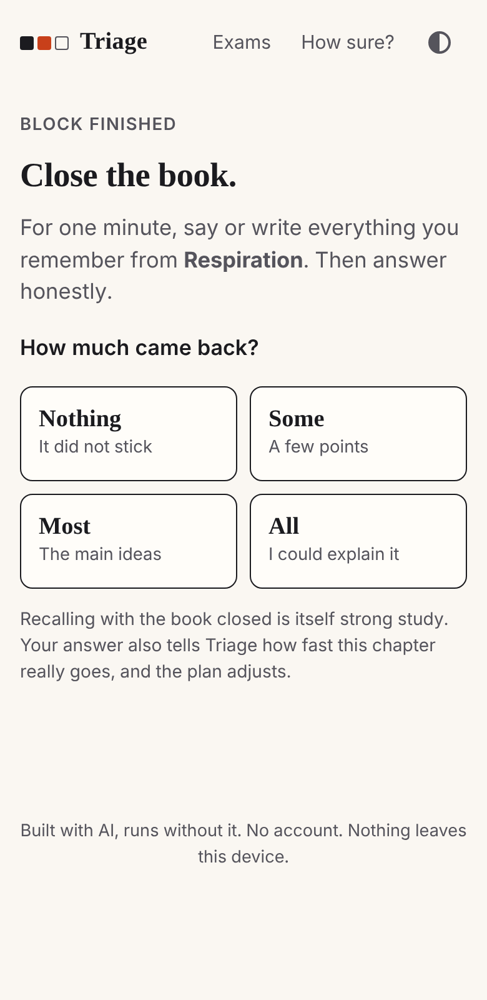
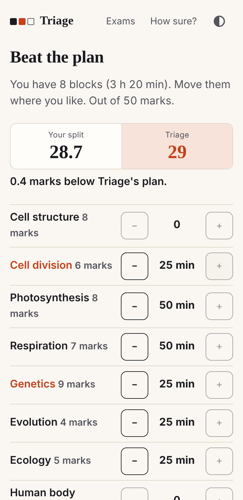

# Triage

**More syllabus than time? Triage tells you what to study, what to skip, and when to stop.**

**Try it: https://ohhjazzv.github.io/Triage/** (no login; tap "Try a sample")



Built for the [CSC Back-to-School Hackathon](https://csc-back-to-school.devpost.com/) (October 2026).

## The problem

It is the evening before an exam. You have 12 chapters and 4 hours. Most students do the same thing:

1. Open chapter 1 and go in book order.
2. Run out of time around chapter 4.
3. Cut sleep to make up for it.
4. Walk in tired, with the last chapters never opened.

Three mistakes: the wrong order, no rule for when to stop, and sleep paid as the price.

## What Triage does

You paste your chapter list. For each chapter you answer one question: **"If a question from this chapter came right now?"** Blank, Bits, Most or Easy. You say when you can study and when you wake up.

Triage then follows three rules.

1. **Marks per minute decides the order.** Each 25-minute block goes to the chapter where it adds the most marks right now.
2. **Skipping is a decision with a price.** You see what to leave tonight and what that costs. Those chapters go on a catch-up list for after the exam.
3. **There is a point where you are done.** The plan never runs past bedtime (sleep is never planned under 6 hours), and it stops early when another block would add almost nothing.

The **Marks Map** shows the whole plan in one picture. Every square is one mark of the paper: solid squares are marks you have now, hatched squares are marks tonight's plan wins, outlined squares are left for later.

| Plan | Closed-book check | Beat the plan |
|---|---|---|
|  |  |  |

Other things it does:

- **Closed-book check.** After each block you close the book, recall for a minute, and tap how much came back. That answer corrects the plan.
- **What to do in a block.** Each block shows three steps, chosen from how well you know the chapter: a first pass, practice questions, or polishing the parts you still get wrong.
- **Off the phone.** Copy the plan as text or print it, so the phone can stay face down while you study.
- **Beat the plan.** Move the blocks around yourself. The forecast updates live.
- **Pin and drop.** Pin a chapter your teacher said is coming; drop one that is not in your exam. A pin shows what it costs.
- **Class link.** The chapter list travels inside a link, so one person sets up the exam and the class opens it. The link never carries anyone's answers.
- **After the exam.** A catch-up list with dates, and your forecast next to your real marks.
- **No account, no server, no tracking.** Everything stays in your browser. It works offline after the first visit.

## How it decides

For each chapter the app knows the marks it carries, how long it is, and how well you know it.

Studying has diminishing returns: the first 25 minutes on a chapter you never opened teach you more than the fourth 25 minutes on a chapter you already know. The app uses one curve per chapter for that:

```
mastery after t minutes = 0.95 − (0.95 − mastery now) × e^(−t / tau)
```

`tau` is 30, 60 or 90 minutes for a short, medium or long chapter. Blank, Bits, Most and Easy start a chapter at 5%, 30%, 60% and 85% of its marks.

Then it hands out your time one block at a time, always to the chapter where that block earns the most marks. It stops when the blocks run out, or when the best next block is worth less than 1% of the paper. Chapters that got no blocks are the "Not tonight" list.

All of it is in [`js/engine.js`](js/engine.js), about 300 lines with comments.

## Built with AI, runs without it

There is no AI inside the running app. That was a decision. An earlier personal project of the author's put a small AI model in the browser, and in testing it invented chapter names and wrong facts. A plan someone bets an exam on should be something they can check. So the planning here is plain arithmetic, the "Why?" under every row shows the numbers, and the app can prove its own plan on your device.

AI is useful at the edge, for reading messy input. If you only have a photo of your syllabus, the setup screen gives you a short message to send to any AI chat you already use; you paste its answer back. No key, no server.

## How sure is this?

This section is in the app too (the "How sure?" screen).

**What is proven.** Under the model above, no other way of splitting the same time scores higher. The tests check this against every possible split on more than 500 random exams, and the app re-checks it live for your own exam.

**What happens when the inputs are wrong.** Students misjudge themselves, and the study speeds are starting guesses. `node tests/robustness.js` simulates students whose answers and speeds are wrong, builds the plan from the wrong inputs, and scores it against the truth. Output on 2 October 2026 (3,000 simulated exams per row):

| Inputs | Ahead of book order | Median lead, marks per 100 | Share of a perfect plan's lead kept |
|---|---|---|---|
| Exactly right | 100.0% of exams | 14.6 | 100% |
| Ratings randomly off by a level | 99.3% | 14.8 | 94% |
| Every rating one level too kind | 100.0% | 13.9 | 95% |
| Every rating one level too harsh | 100.0% | 13.8 | 95% |
| Real speed wrong by up to 2× | 100.0% | 15.3 | 98% |
| Ratings off and speed wrong | 99.2% | 13.2 | 91% |

**What is not proven.** These are simulations inside the app's own model. They show the method is sound if learning has diminishing returns. They do not show that real students gain real marks. Only use over time can show that. This is why every forecast is a range labelled as an estimate, why the closed-book check corrects the plan as you go, and why the app compares its forecast with your real marks afterwards.

## Limits

- The forecast depends on honest answers and on guessed study speeds. It is an estimate, not a promise.
- Marks per chapter are often unknown. Without them the paper is split equally.
- One exam is planned at a time. It does not yet balance several exams against each other across a week.
- It plans time. It does not teach the chapter.
- Nothing is synced. Clearing browser data clears your exams (there is a backup file on the Exams screen).

Next: planning a whole exam week, a QR code for the class link, more languages.

## Run it

It is a static site: no build step and no dependencies.

```
python3 -m http.server 8080     # or any static file server
# open http://localhost:8080
```

Tests (Node 22 or newer):

```
npm test                 # 96 unit tests: engine, time, paste, storage, model
node tests/robustness.js # the simulation table above
node tests/e2e/run.mjs   # 30 browser tests, needs Playwright
```

The browser tests drive a real browser with a controlled clock: a full setup, a study block, the closed-book check, the sleep floor, a daytime exam, the class link, offline use, a browser that blocks storage, keyboard focus, and a check that no request ever leaves the app's own origin.

```
index.html
css/app.css
js/engine.js     the maths: plan, verify, checkIn, range, squares
js/time.js       sessions, the sleep wall, clock times
js/parse.js      smart paste for messy syllabus text
js/store.js      saving, backup, the class link
js/model.js      exam + time -> everything a screen shows
js/ui/           one file per screen
sw.js            offline
tests/           unit tests, robustness simulation, browser tests
prototype/       the first engine sketch (2 October 2026), kept as written
```

## AI-use disclosure

This project was built with heavy use of AI, and the hackathon rules ask for that to be stated plainly.

- **Claude (Anthropic), in Cowork**, helped choose the idea, wrote the engine prototype, and wrote most of the code, the tests and the first drafts of these documents.
- **Jaz** brought the problem from his own exam week, chose to enter solo, set the rule that sleep is never planned under 6 hours, asked for the weak spots of the idea to be closed, and reviewed the result.
- **No AI runs inside the app.**

Earlier work: the author's personal assistant "Taz OS" (1–2 October 2026) had a simple exam-eve list that led to this idea. `prototype/` holds the first sketch of the engine.

## Sources

- Roediger, H. L., & Karpicke, J. D. (2006). Test-enhanced learning: Taking memory tests improves long-term retention. *Psychological Science*. Recalling without the book improved retention days later compared with rereading. Triage uses the closed-book check mainly as an honest measure of what stuck.
- Newbury, C. R., Crowley, R., Rastle, K., & Tamminen, J. (2021). Sleep deprivation and memory: Meta-analytic reviews of studies on sleep deprivation before and after learning. *Psychological Bulletin*. Losing sleep after learning harms memory for what was learned.
- Dunlosky, J., Rawson, K. A., Marsh, E. J., Nathan, M. J., & Willingham, D. T. (2013). Improving students' learning with effective learning techniques. *Psychological Science in the Public Interest*. Practice testing rated among the most useful techniques; rereading and highlighting among the least. The three steps shown in each block follow that.
- Paruthi, S., et al. (2016). Recommended amount of sleep for pediatric populations: A consensus statement of the American Academy of Sleep Medicine. *Journal of Clinical Sleep Medicine*. Teenagers are advised 8 to 10 hours; Triage defaults to 8 and never plans under 6.

## Licence

MIT. See [LICENSE](LICENSE).
